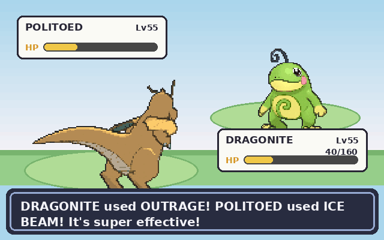

<h1 align="center">DRAGONITE vs POLITOED</h1>

<em>A turn-based Pokémon battle, playable right here on my profile.</em>

  

<h3 align="center">Choose DRAGONITE's move:</h3>

| | |
|:--:|:--:|
| [**OUTRAGE**](https://github.com/Vladdudu12/Vladdudu12/issues/new?title=Battle%3A%20outrage&body=Just%20press%20the%20green%20Create%20button%20below%20to%20make%20your%20move.%0AA%20bot%20will%20play%20the%20turn%20and%20update%20the%20profile%20in%20a%20few%20seconds.) | [**FIRE PUNCH**](https://github.com/Vladdudu12/Vladdudu12/issues/new?title=Battle%3A%20fire-punch&body=Just%20press%20the%20green%20Create%20button%20below%20to%20make%20your%20move.%0AA%20bot%20will%20play%20the%20turn%20and%20update%20the%20profile%20in%20a%20few%20seconds.) |
| [**THUNDERPUNCH**](https://github.com/Vladdudu12/Vladdudu12/issues/new?title=Battle%3A%20thunderpunch&body=Just%20press%20the%20green%20Create%20button%20below%20to%20make%20your%20move.%0AA%20bot%20will%20play%20the%20turn%20and%20update%20the%20profile%20in%20a%20few%20seconds.) | [**ROOST**](https://github.com/Vladdudu12/Vladdudu12/issues/new?title=Battle%3A%20roost&body=Just%20press%20the%20green%20Create%20button%20below%20to%20make%20your%20move.%0AA%20bot%20will%20play%20the%20turn%20and%20update%20the%20profile%20in%20a%20few%20seconds.) |

  <a href="https://github.com/Vladdudu12/Vladdudu12/issues/new?title=Battle%3A%20new&body=Just%20press%20the%20green%20Create%20button%20below%20to%20make%20your%20move.%0AA%20bot%20will%20play%20the%20turn%20and%20update%20the%20profile%20in%20a%20few%20seconds.">🔄 <b>Start a new battle</b></a>

---

<b>How does this work?</b>

GitHub strips JavaScript from READMEs, so this isn't a live game — it's turn-based
by commit. Each move above is a link that opens a pre-filled GitHub Issue. When you
submit it, a GitHub Action runs <code>battle.py</code>, resolves your move and
Politoed's reply, re-renders the animated scene, rewrites this README, and commits.
Refresh in a few seconds to see the result.

<b>Tip:</b> Politoed is a Water type. Think about what beats Water. 💡

